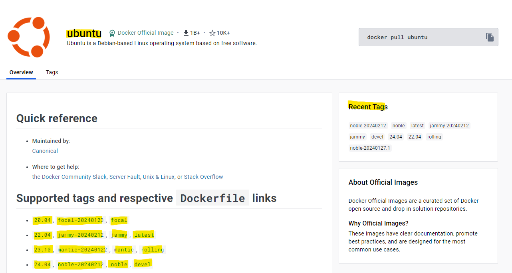

# Creating Your First Container

In this first exercise, we'll learn how to:
* Pull images
* Start containers
* Stop containers
* Remove containers

## Pulling images

To start a container, you'll need to first have an image. Images are needed since they are like recipes needed to spin up a container.

1. Let's start by seeing what images you currently have on your machine, by running `docker images`:

   ```sh
   $ docker images
   REPOSITORY       TAG             IMAGE ID        CREATED         SIZE
   ```

2. On a fresh installation of Docker, you shouldn't have any images. We can go pull some images from remote repositories, the default one should be [Docker Hub](https://hub.docker.com/).

   
   
   You can pull them using image name along with/without specific image tags. For example, to pull the latest Ubuntu version you can either do:
   ```sh
   # format: image-name
   docker pull ubuntu
   ```
   or
   ```sh
   # format: image-name:image-tag
   docker pull ubuntu:latest
   ```

   You can also get specific versions of the image by using tags like this:
   ```sh
   docker pull ubuntu:23.10
   docker pull ubuntu:focal
   ```

   After pulling an image, try doing `docker images` again, this time, there should be a list of image(s) available to you.

## Running a container

Unlike using a VM or Virtualization tool, Docker is an application-layer container tool, we cannot just start an image and let it run idly. We need to specify **command** for the container to run, as it once finished the container shall stop.

The command can be anything as long it existed on the image. We are using Ubuntu, so anything from Linux commands should work.

1. Let's try with the simplest example. Try `echo Hello World` with container.
   
   ```sh
   # docker run <image> <command> [args]
   $ docker run ubuntu /bin/echo 'Hello World'
   ```

   When you fire the `docker run` command, Docker creates a new container from the image specified, and runs the command once the container is fully started.

2. We can now check for container list.
   
   ```sh
   docker ps
   ```

   Note: If there's nothing showing up, it means that the containers might be stopped. Try using flag `-a`.

3. Let's try something more interactive.
   
   By default, Docker runs everything in its own container, it isolates any functionality with the host. However, sometimes you'll need to interact with the containers. The way to start interacting with a container is to run with `-it` flag.
   
   ```sh
   docker run -it ubuntu /bin/bash
   ```

   Now, you'll be in the bash session of the container. Notice your terminal is now running with user `root` followed by container ID.

   To end the bash session, you can run `exit` to exit from the container and stop it.

4. By default, running containers will automatically attach you to the container, meaning that you cannot use the terminal to do anything else unless the container is stopped.

   Docker can start the container detached from your terminal, you just need the `-d` flag.

   ```sh
   docker run -d ubuntu /bin/sleep 5000
   ```

5. We can also stop or kill containers when they take up time. To do so, we can use `docker stop` and `docker kill`.

   We also need to specify the specific container, using `docker ps`

   ```sh
   # graceful
   docker stop <container-id>

   # force
   docker kill <container-id>
   ```

## Removing containers

We can delete unused containers by:
* One-by-one
  ```sh
  # must be stopped
  docker rm <container-id>
  ```

* All unused
  ```sh
  docker container prune
  ```