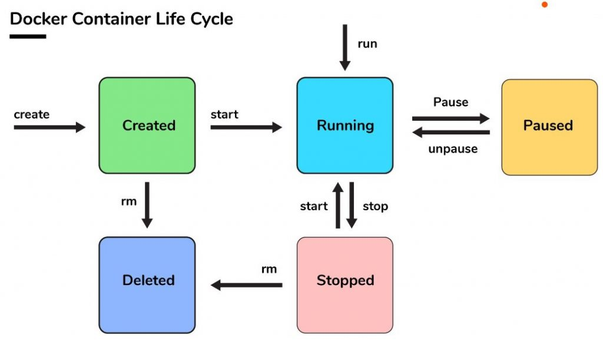

# Saving Changes to the Image

In this exercise, you'll learn how to:
* Understand the container lifecycle
* Save changes made in container

## The Docker container lifecycle


Whenever a Docker container is removed, its data and state is resetted or removed. This means that whenever you need to update the Docker container with a new image, all the data is gone.

However in some cases like Ubuntu or Linux images, we might want to save changes to our image. Such as, installing a new package, setting environment variables, writing pre-determined configurations.

## Saving changes in container
1. Let's try adding a new package to our container, spin up a new Ubuntu container:
   
   ```sh
   $ docker run -it ubuntu /bin/bash
   root@f29e415b> apt update && apt install -y cowsay
   root@f29e415b> cowsay Hello World!
   ```

2. We can commit changes of adding the `cowsay` package by using `docker commit`, however make sure that you're not starting the container again.
   
   ```sh
   docker commit -m "Added cowsay" <container-id> gdscku/cowsay
   ```

   Now to make sure, check the image list:
   
   ```sh
   docker images
   ```

3. Finally, we can run our new image and use the `cowsay` command without needing to installing it with `apt`:
   
   ```sh
   docker run -it --rm gdscku/cowsay /bin/cowsay Hello Again!
   ```
