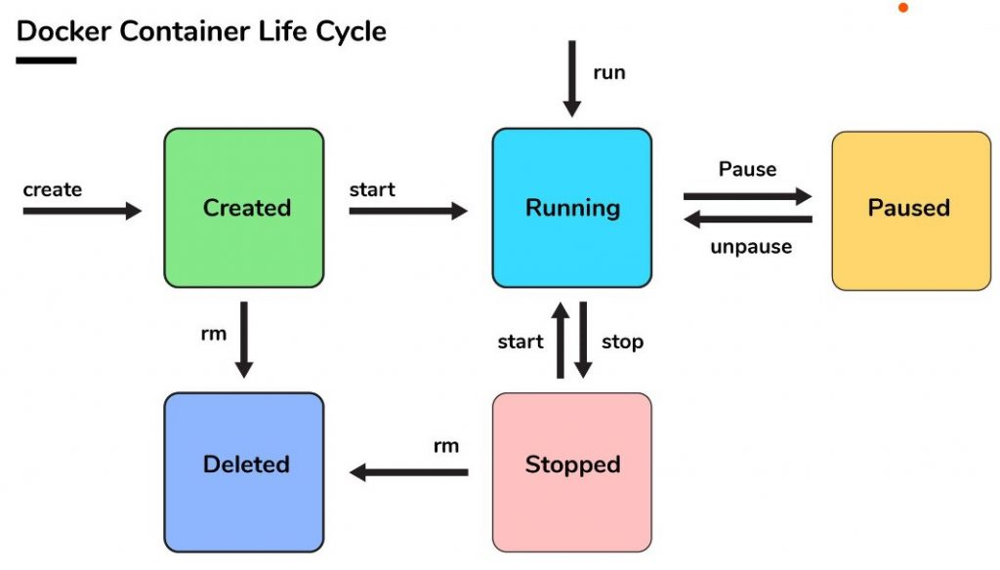

# Keeping Data Persistent with Volumes

In this exercise, you'll learn how to:
* Creating a volume to store persistent data
* Mounting a volume to host machine

## The Docker container lifecycle


Whenever a Docker container is removed, its data and state is resetted or removed. This means that whenever you need to update the Dockerfile with a new configuration, all the data is gone.

This means, if you have a database container (Mongo, MySQL, Postgres etc.), you risk losing data after the container has stopped. However, Docker allows you to mount your data from container to a location in the machine to store them there instead.

The way to persist data from Docker, is to use Volumes.

## Testing the theory
1. Start off by building the `Dockerfile` within the directory, then build and run it (see `ex03`).

2. Edit the `index.html` in the container,
   
   ```sh
   $ docker exec -it <container-id> /bin/bash
   root@...> vi /usr/local/apache2/htdocs/public-html/index.html
   root@...> exit
   ```

   Then, visit the site to see changes.

3. Stop the container with `docker stop <container-id>`

4. Re-run the container with `docker run -d -p --rm 8080:80 <image>`

## Creating and using a volume

Once you revisit the page, you can see that your contents has been overridden by the default state of the container. However, we can use volumes to store any persistent data.

1. Check whether we have any volumes in the system.
   
   ```sh
   $ docker volume ls
   DRIVER                   VOLUME NAME
   ```

2. To create a new volume, run `docker volume create` and give it a name.
   
   ```sh
   docker volume create <volume-name>
   ```

3. Now, we can attach our volume to the new container runs.
   
   ```sh
   docker run --rm -d -p 8080:80 -v <volume-name>:/usr/local/apache2/htdocs/ <image>
   ```

4. Then we can [test out the theory](#testing-the-theory) to see, whether our changes are saved across container runs.
